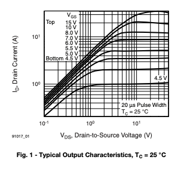

# Supersaurus Bone Interactive

https://github.com/user-attachments/assets/5193e17a-1725-41bf-98e3-4b2cfe211b8b

## Overview

The Supersaurus bone interactive at Thanksgiving Point's Museum of Ancient Life invites visitors to guess which dinosaur the Supersaurus is related to based solely on scapula bone graphics. Guests place the Supersaurus scapula into one of three slots, each corresponding to a different dinosaur with its own scapula graphic. When they're ready to check their answer, they press a button, and an LED light strip installed behind the frosted acrylic slots briefly lights up red or green, providing immediate feedback.

I thought this would be a great opportunity and challenge to design an interactive without using a microcontroller, which led me to a deep dive into 555 timers, MOSFETs, PCB design and manufacturing, and more. This repository documents that learning process, and includes schematics, design decisions, and links to relevant datasheets.

## Main Hardware Components

- T.I. NE555P Timer ([datasheet](https://www.ti.com/lit/ds/symlink/ne555.pdf?ts=1777883502652))
- IRF520 MOSFET ([datasheet](https://www.vishay.com/docs/91017/irf520.pdf))
- PWM RGB LED Strips [link](https://www.amazon.com/dp/B0FSWXXXD4?ref=fed_asin_title&th=1)

## Full Schematic

## Main Hardware Architecture

Each 555 timer's TRIG pin is connected to a single reed switch (mounted behind the slot guests put the bone in), and each reed switch feeds into one "master" N.O. button. RC/pull up networks are configured for each TRIG pin to ensure smooth and predictable switching. This configuration allows the TRIG pin on each 555 timer to be pulled LOW only when its corresponding reed switch is closed **and** the button is pressed.

The three 555 timers are used in monostable mode to output a short pulse signal on pin Q when the TRIG pin is pulled low. More on monostable mode and the duration of the pulse below. The output signal (~10.3V when VCC=12V) is fed into the gate of a IRF520 N-channel MOSFET module, which switches the low side of an RGB LED Strip for as long as the gate is actuated.

## 555 Timer Notes

### Monostable Mode

Shorting the DISCHARGE and THRESHOLD pins of the 555 timer and routing them to an RC circuit operates the 555 timer in monostable mode. Ben Eater has a really great and informative series on the different 555 timer modes, I highly recommend watching them. Here's the one about [monostable mode](https://www.youtube.com/watch?v=81BgFhm2vz8).

In any case, the formula for the output signal duration is

$$
t_w = 1.1 * R_A * C
$$

Where R_A and C are the values of the resistor and capacitor in Ohms and Farads. For future boards I wanted to make this duration configurable, and my first idea to accomplish this is to have three open jumpers routed to resistors of different values (22k, 33k, 47k) which will give different duration lengths depending on which jumper is soldered.

### Power-on Reset Circuit

The 0.22uF and 10k RC network on the 555's RESET pin form a POR (power-on reset) circuit. During intial power-up testing without it, the output (Q) pin produced occasional HIGH pulses due to undefined internal states of the IC, which turned on downstream LED strips. This RC network briefly holds RESET low during power-up, forcing Q in a known LOW state while internal circuitry stabilizes. As the 0.22uF capacitor charges, RESET rises to VCC and normal operation begins, preventing false triggering at startup.

### Output (Q) Voltage

When triggered, the output voltage on pin Q isn't necessarily equal to VCC. When powered by 5V, I measured outputs of ~3.3V. When powered by 12V, I measured outputs of ~10.3V. The datasheet confirms this slight drop in voltage, and it is important to know since we'll be using it to drive the gate of an N-Channel MOSFET.

## IRF520 N-Channel MOSFET Notes

Below are some of the important electrical characteristics I'll be talking about. For a deeper dive, refer to the [datasheet](https://www.vishay.com/docs/91017/irf520.pdf)

- $V_{GS(th)}$ (gate-source threshold voltage): 2.0-4.0V @ $V_{DS} = V_{GS}$, $I_D = 200{µA}$
  - The point at which the MOSFET barely starts to conduct current from drain to source. It is highly recommended to drive the gate much higher than this value. This advice will be clarified further below.
- $R_{DS(on)}$ (drain-source on-state resistance): 0.27Ω @ $V_{GS} = 10V, I_D = 5.5A$
  - The effective _on_ resistance between the drain and source of the MOSFET. We want this to be as low as possible, since the power drawn by the MOSFET is given by $P = I^2 * R$
- $I_D$ vs. $V_DS$ curve at T = 25C (from datasheet)

- in the ohmic region (linear region of the curve) the MOSFET acts like a voltage controlled resistor, where
  $$
  I_D = \frac{V_{DS}}{R_{DS(on)}}
  $$
