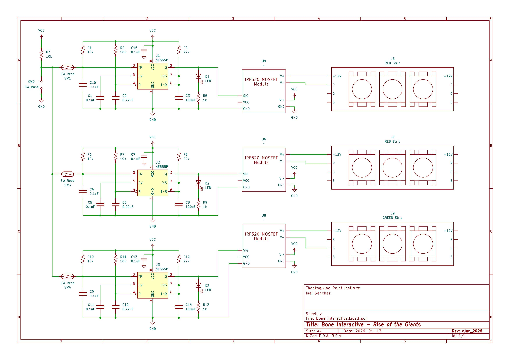

# Supersaurus Bone Interactive

https://github.com/user-attachments/assets/5193e17a-1725-41bf-98e3-4b2cfe211b8b

## Overview

The Supersaurus bone interactive at Thanksgiving Point's Museum of Ancient Life invites visitors to guess which dinosaur the Supersaurus is related to based solely on scapula bone graphics. Guests place the Supersaurus scapula into one of three slots, each corresponding to a different dinosaur with its own scapula graphic. When they're ready to check their answer, they press a button, and an LED light strip installed behind the frosted acrylic slots briefly lights up red or green, providing immediate feedback.

I thought this would be a great opportunity and challenge to design an interactive without using a microcontroller, which led me to a deep dive into 555 timers, MOSFETs, PCB design and manufacturing, and more. This repository documents that learning process, and includes schematics, design decisions, and links to relevant datasheets.

## Main Hardware Components

- T.I. NE555P Timer ([datasheet](https://www.ti.com/lit/ds/symlink/ne555.pdf?ts=1777883502652))
- IRF520 MOSFET ([datasheet](https://www.vishay.com/docs/91017/irf520.pdf))
- PWM RGB LED Strips [link](https://www.amazon.com/dp/B0FSWXXXD4?ref=fed_asin_title&th=1)
- Full BOM is included in the `docs/` folder

## Full Schematic

## Main Hardware Architecture

Each 555 timer's TRIG pin is connected to a single reed switch (mounted behind the slot guests put the bone in), and each reed switch feeds into one "master" N.O. button. RC/pull up networks are configured for each TRIG pin to ensure smooth and predictable switching. This configuration allows the TRIG pin on each 555 timer to be pulled LOW only when its corresponding reed switch is closed **and** the button is pressed.

The three 555 timers are used in monostable mode to output a short pulse signal on pin Q when the TRIG pin is pulled low. More on monostable mode and the duration of the pulse below. The output signal (~10.3V when VCC=12V) is fed into the gate of a IRF520 N-channel MOSFET module, which switches the low side of an RGB LED Strip for as long as the gate is actuated.

## 555 Timer Notes

### Monostable Mode

Shorting the DISCHARGE and THRESHOLD pins of the 555 timer and routing them to an RC circuit operates the 555 timer in monostable mode. Ben Eater has a really great and informative series on the different 555 timer modes, I highly recommend watching them. Here's the one about [monostable mode](https://www.youtube.com/watch?v=81BgFhm2vz8).

In any case, the formula for the output signal duration is

$$
t_w = 1.1 \times R_A \times C
$$

Where R_A and C are the values of the resistor and capacitor in Ohms and Farads. For future boards I wanted to make this duration configurable, and my first idea to accomplish this is to have three open jumpers routed to resistors of different values (22k, 33k, 47k) which will give different duration lengths depending on which jumper is soldered.

Note: the trigger pulse must be shorter than $t_w$ and below $\frac{1}{3}V_{CC}$ (the 555's internal comparator threshold). If TRIG remains below $\frac{1}{3}V_{CC}$ beyond $t_w$, the output holds HIGH until TRIG rises.

### Power-on Reset Circuit

The 0.22uF and 10k RC network on the 555's RESET pin form a POR (power-on reset) circuit. During initial power-up testing without it, the output (Q) pin produced occasional HIGH pulses due to undefined internal states of the IC, which turned on downstream LED strips. This RC network briefly holds RESET low during power-up, forcing Q in a known LOW state while internal circuitry stabilizes. As the 0.22uF capacitor charges, RESET rises to VCC and normal operation begins, preventing false triggering at startup.

### Output (Q) Voltage

When triggered, the output voltage on pin Q isn't necessarily equal to VCC. When powered by 5V, I measured outputs of ~3.3V. When powered by 12V, I measured outputs of ~10.3V. The datasheet confirms this slight drop in voltage, and it is important to know since we'll be using it to drive the gate of an N-Channel MOSFET.

## MOSFET Selection and Gate Drive Design Notes

### Role

We want the MOSFET to be used as a low-side switch (N-channel!) to control a 12V RGB LED strip. The design requirement is to switch currents on the order of 1–2A with minimal power dissipation and predictable behavior across MOSFET parameter variations.

### Initial Implementation and Failure Mode

My initial prototype powered the 555 timer at VCC = 5V and used the output (Q) pin to directly drive the gate of an IRF520 MOSFET module. While the timing circuit functioned correctly, the LED strip failed to illuminate properly. This failure mode was not due to wiring or logic errors, but rather improper gate drive conditions for the selected MOSFET.

### Key Electrical Considerations

Below are some of the important electrical characteristics I'll be talking about. For a deeper dive, refer to the [datasheet](https://www.vishay.com/docs/91017/irf520.pdf)

#### 1. $V_{GS}$ Gate Threshold Voltage

The IRF520 specifies a gate-source threshold voltage:

- $V_{GS(th)} = 2.0\,\text{V}$ to $4.0\,\text{V}$ at $I_D = 250\,\mu\text{A}$

This parameter is **not** an operating point — it defines the voltage at which the MOSFET begins to conduct a very small current. The best design drives the gate well past this threshold; designing around $V_{GS(th)}$ leads to unpredictable and unreliable switching behavior.

#### 2. Required Gate Voltage for Switching Applications

For switching applications, the MOSFET must operate in the **ohmic (linear) region** (the $I_D$ vs. $V_{DS}$ graph below shows this region for various $V_{GS}$ curves) with as low a $R_{DS(on)}$ as possible. The lower the resistance, the less power is dissipated.

From the datasheet: $R_{DS(on)} = 0.27\,\Omega$ at $V_{GS} = 10\,\text{V}$

#### 3. $I_D$ vs. $V_{DS}$ graph at T = 25C (from datasheet)

    <image src="docs/assets/ID-vs-VDS-curve.png" alt="id-vs-vds-curve">

In the ohmic region (linear region of the curves) the MOSFET acts like a voltage controlled resistor, where

$$
I_D = \frac{V_{DS}}{R_{DS(on)}}
$$

note that $R_{DS(on)}$ is not a fixed quantity, but decreases as $V_{GS}$ rises above $V_{GS(th)}$. The datasheet value of $0.27\,\Omega$ only holds at $V_{GS} = 10V$. Near the threshold voltage, it can be orders of magnitude higher, which directly increases power drawn ($P = I^2 * R$). Otherwise, in the saturation region, the MOSFET essentially acts as a current source, due to how the drain current $I_D$ stays nearly constant regardless of $V_{DS}$.

### Gate Drive Design

With a 5V-powered 555 timer, the output pin's high voltage falls between 2.75V-3.3V. This is exactly in the MOSFET's $V_{GS}$ range where it barely starts to open and conduct current. This is a huge reliability concern, because:

- If the specific MOSFET we used had a $V_{GS(th)}$ = 2V: the MOSFET would slightly conduct
- If the MOSFET had a $V_{GS(th)}$ = 3.3V: the MOSFET would be right at threshold — essentially off
- If the MOSFET had a $V_{GS(th)}$ = 4V: the MOSFET wouldn't conduct at all

To ensure proper MOSFET operation, the gate drive voltage must be increased to a level where $R_{DS(on)}$ is low and well-defined.

Two viable approaches were considered:

#### Option 1: Use a Logic-Level MOSFET (IRLZ44N) with 5V supply for 555 timers

- Pros: compatible with lower level logic
- Cons: complicates power architecture (12V for LED strips and 5V for 555 timers)

#### Option 2: Increase Gate Drive Voltage (Selected)

Power the 555 timers at 12V (note: 5V sits at the lower bound of the NE555's recommended operating range). This results in:

- A gate drive voltage of ~10.3V
- A fully enhanced ("on") IRF520
- A single 12V supply for the entire system

### Final Operating Behavior Calculations

Each LED strip draws 1.67A at 12V, measured directly on the bench. With the 555 timers powered at VCC = 12V, the gate sees ~10.3V — close to the datasheet condition of $V_{GS} = 10\,\text{V}$, so $R_{DS(on)} = 0.27\,\Omega$ applies directly.

The voltage drop across the MOSFET when fully on is

$$
V_{DS} = I_D \times R_{DS(on)} = 1.67\,\text{A} \times 0.27\,\Omega \approx 0.45\,\text{V}
$$

This confirms the MOSFET is in the ohmic region: ohmic operation requires $V_{DS} < V_{GS} - V_{GS(th)}$, and $0.45\,\text{V} \ll 10\,\text{V} - 2\,\text{V} = 8\,\text{V}$. The power dissipated by the MOSFET is

$$
P = I_D^2 \times R_{DS(on)} = (1.67\,\text{A})^2 \times 0.27\,\Omega \approx 0.75\,\text{W}
$$

At 0.75W, the IRF520 in its TO-220 package dissipates comfortably without a heatsink — a viable operating point for this application.
